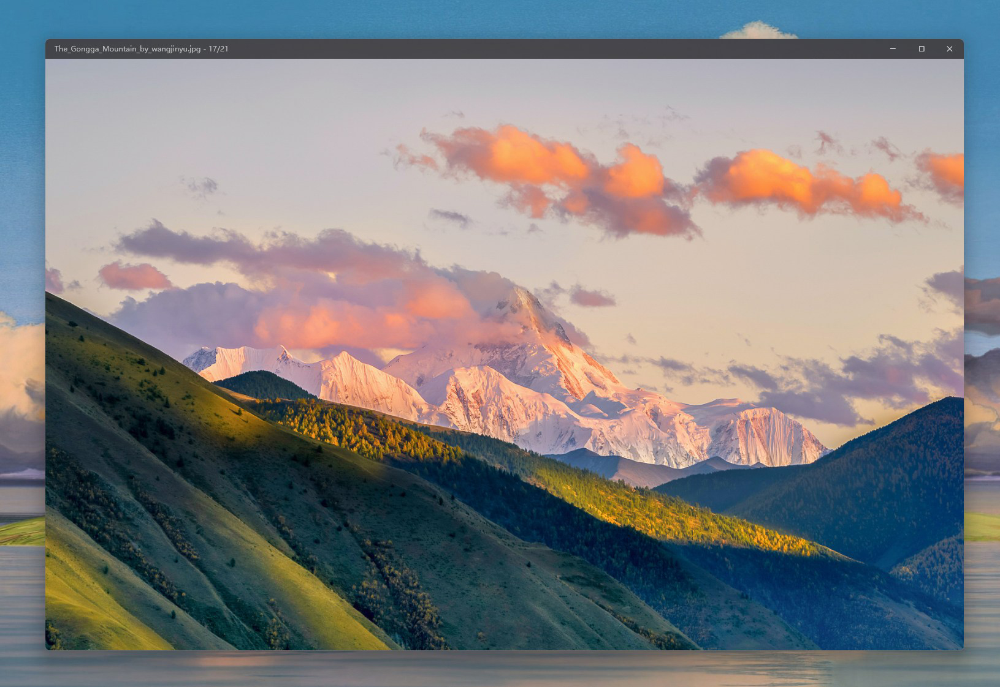
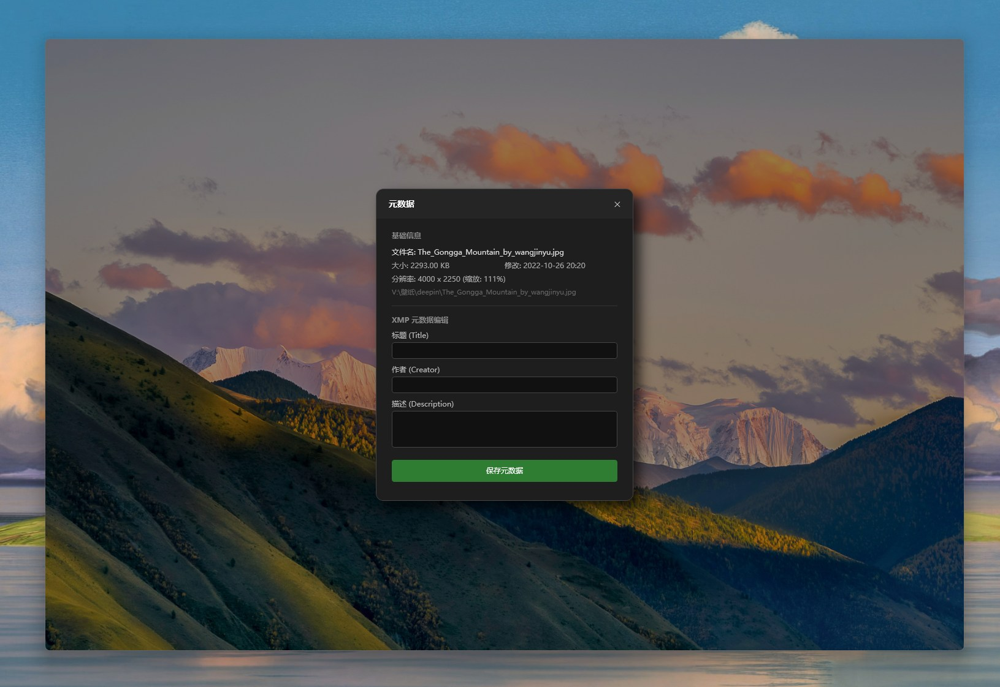
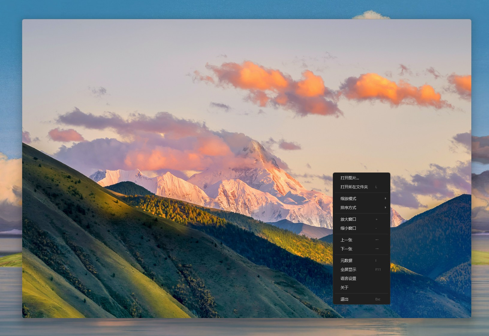
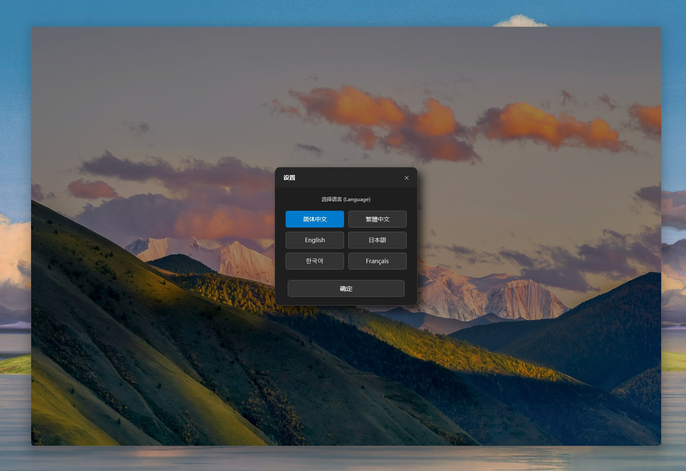
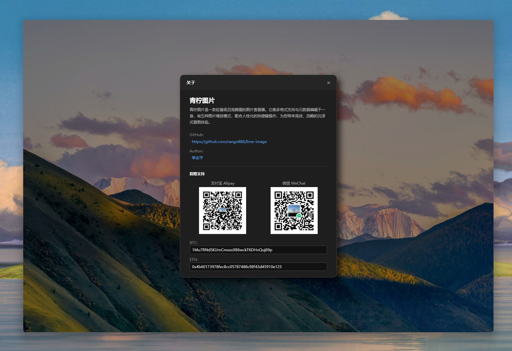

  <a href="README.zh-CN.md">简体中文</a> |
  <a href="README.zh-TW.md">繁體中文</a> |
  <a href="README.md">English</a> |
  <a href="README.ja.md">日本語</a> |
  <a href="README.ko.md">한국어</a> |
  <a href="README.fr.md">Français</a>

 

  
  <h1>Visionneuse d'images Lime</h1>

> **Lime Image Viewer** est une visionneuse d'images légère, élégante et performante. Elle combine la prise en charge de multiples formats avec une édition puissante des métadonnées. Dotée de cinq modes de zoom pratiques et de raccourcis clavier intuitifs, elle vous offre une expérience de visionnage immersive, fluide et sans distraction.

---

## ✨ Caractéristiques principales

### 🎨 Expérience visuelle immersive
- **Design sans bordure**: Abandonnant les bordures de fenêtre traditionnelles encombrantes, la barre de menu est automatiquement masquée et n'apparaît élégamment que lorsque la souris la survole. Chaque pixel est dédié à votre image.
- **Transitions fluides**: Une logique de chargement d'image profondément optimisée assure un changement soyeux, sans aucun décalage.

### 🔍 Modes de zoom pratiques
Lime propose 5 logiques de zoom intelligentes pour répondre à différents scénarios (**Basculement rapide via les touches numériques `1` - `5`**) :
1.  **Zoom automatique intelligent**: Identifie intelligemment le rapport hauteur/largeur de l'image. Les images en paysage s'adaptent à la largeur, les portraits à la hauteur, garantissant que l'image est toujours entièrement visible.
2.  **Verrouillage de la mise au point (Mode comparaison)**: Conçu pour la sélection de photos en rafale ou le jeu des différences. Lorsque vous zoomez sur un détail (par exemple, le coin supérieur gauche) et passez à l'image suivante, le logiciel conserve exactement le même niveau de zoom et la même position, évitant les ajustements répétitifs.
3.  **Verrouillage central**: Maintient le niveau de zoom actuel après le changement d'image, en se basant toujours sur le centre de l'écran.
4.  **Priorité à la largeur**: Force l'image à remplir la largeur de la fenêtre (idéal pour lire des bandes dessinées web ou des captures d'écran).
5.  **Priorité à la hauteur**: Force l'image à remplir la hauteur de la fenêtre.

### 🛠 Ensemble d'outils puissants
- **Édition de métadonnées multi-formats**: Prend en charge non seulement la visualisation, mais aussi l'édition des métadonnées de l'image.
- **Redimensionnement rapide de la fenêtre**: Permet de redimensionner rapidement la fenêtre du logiciel via des raccourcis pour s'adapter de manière flexible aux différentes résolutions d'écran.
- **Support complet des formats**: png, jpeg, jpg, bmp, gif, tif, tiff, webp, ico, jfif, heic, heif, avif, jxl, svg, psd, psb, dds, tga, xcf, hdr, exr, dng, cr2, cr3, nef, arw, orf, rw2, raf, sr2, srw, pef, x3f, erf, mef, mos, mrw, 3fr, kdc, jp2, j2k, jpf, jpx, jpm, mj2, pbm, pgm, ppm, pnm, pam, pcx
- **Tri flexible**: Prise en charge du tri par **Nom de fichier**, **Date de modification** ou **Taille du fichier** par ordre croissant ou décroissant, pour une gestion organisée des fichiers.

### 🌍 Support multilingue
Chinois simplifié, Chinois traditionnel, Anglais, Japonais, Coréen, Français.

---

## ⌨️ Guide des raccourcis

Pour améliorer l'efficacité de la navigation, Lime Image Viewer propose de nombreux raccourcis clavier :

| Catégorie | Touche | Description |
| :--- | :---: | :--- |
| **Navigation** | `←` / `→` / `Molette` | Image précédente / suivante (Appui long pour défilement rapide) |
| | `Home` | Sauter à la première image du dossier |
| | `End` | Sauter à la dernière image du dossier |
| | `Esc` | Fermer la fenêtre |
| **Contrôle Vue** | `+` / `-` | Agrandir / Réduire rapidement la fenêtre du logiciel |
| | `F11` | Activer / Quitter le mode plein écran |
| | `L` | Ouvrir le dossier actuel et localiser le fichier |
| | `I` | Afficher / Masquer le panneau de métadonnées |
| **Modes Zoom** | `1` - `5` | Basculer les modes (Auto/Focus/Centre/Largeur/Hauteur) |
| **Tri** | `N` / `Shift + N` | Trier par **Nom** Croissant / Décroissant |
| | `T` / `Shift + T` | Trier par **Temps** Croissant / Décroissant |
| | `S` / `Shift + S` | Trier par **Taille** Croissant / Décroissant |

---

## 🖼 Galerie

### 1. Navigation immersive
Une interface épurée qui garde votre attention sur l'image elle-même.

### 2. Menu flottant intelligent
Apparaît automatiquement lorsque la souris s'approche du haut ; reste caché sinon pour ne pas déranger.

### 3. Édition de métadonnées
Visualisez et modifiez rapidement les métadonnées de l'image.

### 4. Menu contextuel efficace
Accédez aux fonctions courantes en un seul clic.

### 5. Internationalisation

---

## 📥 Téléchargement et installation

- **Version installable**: [Télécharger ici](https://github.com/rango886/lime-image/releases/download/1.0/Lime.image.x64.exe)
- **Version portable**: [Télécharger ici](https://github.com/rango886/lime-image/releases/download/1.0/Lime.Image.portable.zip)

---

## ☕ Donation et support

Si **Lime Image Viewer** a amélioré votre efficacité ou vous a apporté une expérience agréable, n'hésitez pas à offrir un jus de citron vert à l'auteur. Votre soutien permet de continuer le développement et la maintenance !

