# Lime Image

一个看图软件，打开快，翻页快，放大缩小跟手。

支持 Windows / macOS / Linux。

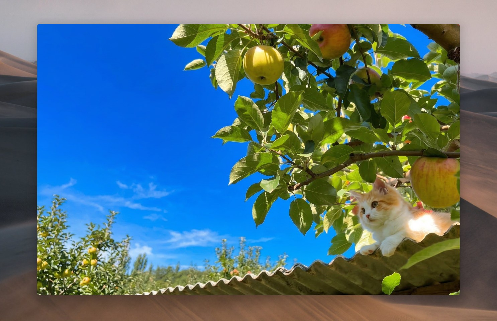
<!-- 截图占位：主界面，无标题栏、纯图片的样子 -->

## 为什么会有它

系统自带的看图工具，打开几十兆的照片要转半天圈；专业软件又太重，
点开还得等它加载一堆东西。lime image 想做的事很简单：双击图片，图立刻出来，
翻下一张不用等。顺便把漫画、长图、RAW 照片这些平时比较麻烦的东西也一起支持了。

## 装上之后先做什么

1. 打开程序，第一次会让你选界面语言（简体中文 / 繁體中文 / English / 日本語 / 한국어），选完就进主界面。
2. 想让它变成双击图片的默认程序：
   - Windows：运行 `Release 安装包 里的 setup.bat`，源码在 `packaging/windows`。
   - Linux：把 `packaging/linux/lime-image.desktop` 装进 `~/.local/share/applications/`，再用 `xdg-mime` 设一下默认。
   - macOS：在 Finder 里右键图片 → 显示简介 → 打开方式里选它。
3. 语言、主题这些随时能改，按 **F12** 进设置。

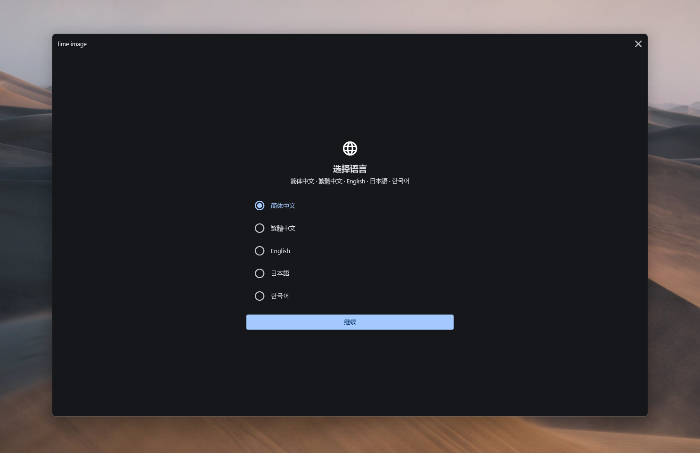
<!-- 截图占位：首次启动的语言选择页 -->

## 基本操作

- **翻页**：滚轮，或者 ← →。按住方向键可以连着翻。
- **缩放**：Ctrl + 滚轮，以鼠标位置为中心放大缩小。也可以用 `+` `-`。
- **移动画面**：按住左键拖，松手有惯性，像甩手机相册那样。
- **回到正常大小**：`0` 是 100%，`Shift+0` 是适应窗口。
- **打开图片**：Ctrl+O，或者直接把文件、文件夹拖进窗口。拖一个文件夹进来会把整个文件夹当图集看。

打开一张图，同目录下的其他图片会自动排进列表，直接就能左右翻。

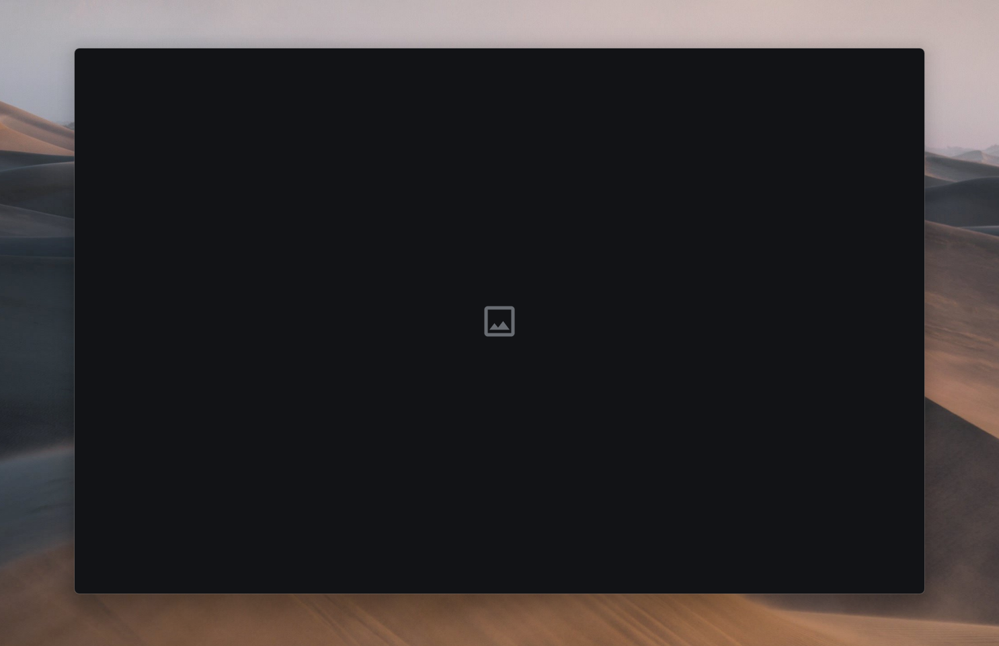
<!-- 截图占位：拖文件进窗口的提示效果 -->

## 界面长什么样

默认是没有标题栏的，整个窗口就是图片。鼠标移到窗口最上面，标题栏才滑出来，
上面只有文件名和最小化/最大化/关闭三个按钮；鼠标离开一会儿它自己收回去。
如果不喜欢这种，设置 → 外观里可以让它一直显示。

所有信息——第几张、图片尺寸、当前缩放比例、文件大小、拍摄时间、缓存占用等等——
都塞在一个半透明的小浮窗里，按 **H** 开关。它可以放在四个角的任意一个，透明度也能调。
里面还能展开看照片的 EXIF、XMP 信息（光圈快门 ISO 那些）。

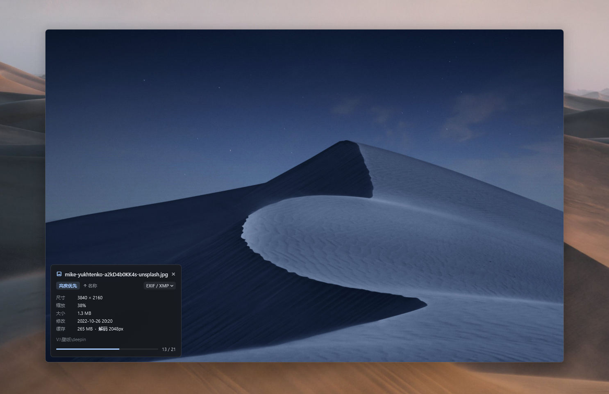
<!-- 截图占位：右下角状态浮窗展开 EXIF 的样子 -->

底下按 **B** 会弹出缩略图条，按 **G** 是整页的网格总览，适合在一堆图里快速找一张。

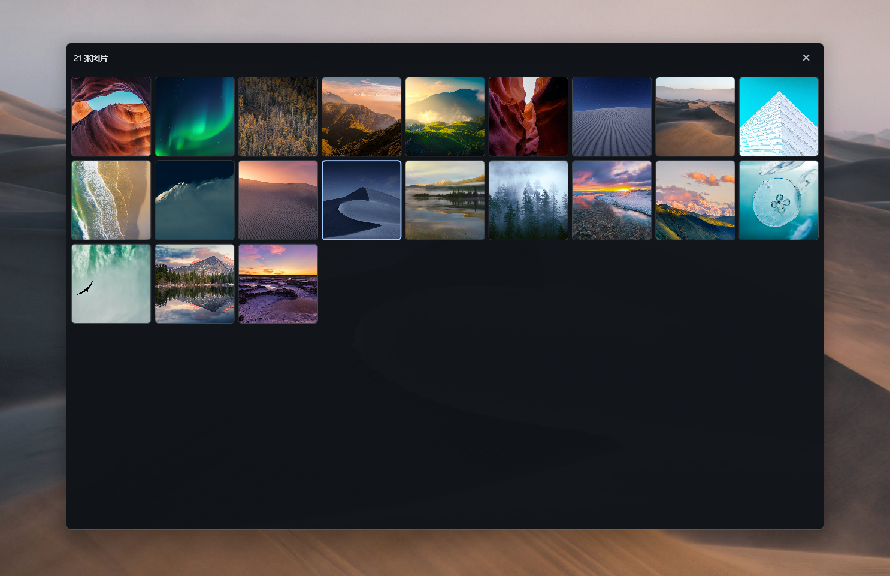
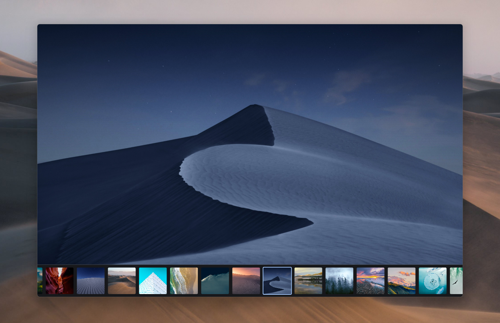
<!-- 截图占位：网格总览界面 -->

## 八种看图方式

这大概是这个软件最有用的部分。按数字键 **1~8** 直接切换，切换后立刻生效。

| 键 | 方式 | 什么时候用 |
|---|---|---|
| **1** | 自动缩放 | 平时用这个。横图按窗口宽度、竖图按窗口高度铺满，小图也会放大，不裁切 |
| **2** | 焦点缩放锁定 | 放大到某个细节后翻页，下一张还停在同样的位置和倍率。对比图片细节很好用 |
| **3** | 宽度优先 | 图片宽度撑满窗口，上下拖着看。适合竖着的长图 |
| **4** | 高度优先 | 高度撑满，左右看。适合特别宽的图 |
| **5** | 中心缩放锁定 | 记住倍率，但永远居中 |
| **6** | 双页模式 | 两张拼一起看，像翻开的书。←/→ 一次翻两页，Shift+←/→ 只翻一页 |
| **7** | 漫画模式 | 整个文件夹当成一条无缝长卷，一直往下滚，页与页之间不停顿 |
| **8** | 长图模式 | 单张超长图（截图长图、条漫）用这个，随便拖随便放大 |

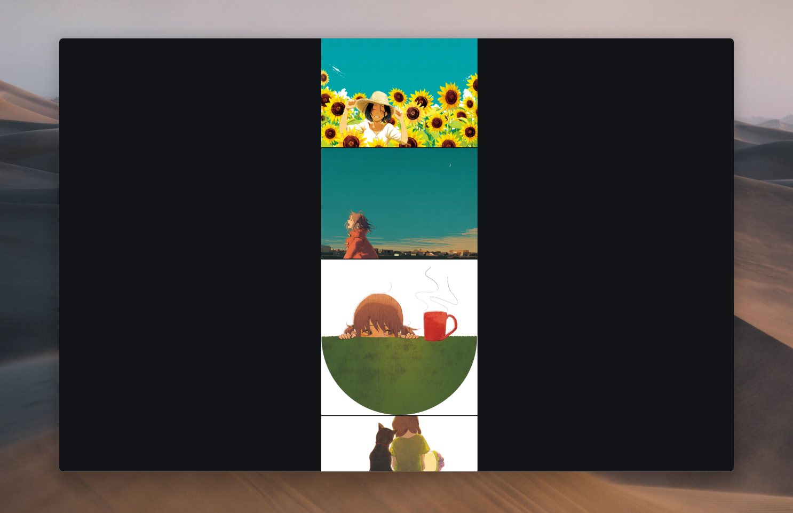
<!-- 截图占位：漫画模式连续滚动 -->

漫画模式还能设成日漫方向（从右往左翻），在设置 → 查看方式里。
cbz / zip 打包的漫画直接拖进来就能看，不用解压。

## 快捷键一览

默认是下面这些，**全部都能改**（设置 → 快捷键，点一下按钮直接录制新按键，冲突了会提示）。

### 浏览
| 按键 | 作用 |
|---|---|
| ← / → 、滚轮 | 上一张 / 下一张 |
| Shift+← / → | 单页翻（双页模式下用） |
| Ctrl+← / → | 往前 / 往后跳 10 张 |
| Home / End | 第一张 / 最后一张 |
| F5 | 重新载入当前图片 |

### 缩放和移动
| 按键 | 作用 |
|---|---|
| Ctrl+滚轮 | 以鼠标为中心缩放 |
| `+` / `-` | 放大 / 缩小 |
| `0` / Shift+0 | 100% / 适应窗口 |
| ↑ / ↓ | 上下滚动 |
| Shift+↑ / ↓ | 左右滚动 |
| PgUp / PgDn | 翻一屏 |

### 查看方式
| 按键 | 作用 |
|---|---|
| 1 ~ 8 | 自动 / 焦点锁定 / 宽度优先 / 高度优先 / 中心锁定 / 双页 / 漫画 / 长图 |

### 排序
| 按键 | 作用 |
|---|---|
| N / Shift+N | 按名称 正序 / 逆序 |
| T / Shift+T | 按时间 正序 / 逆序 |
| S / Shift+S | 按大小 正序 / 逆序 |
| Shift+Z | 随机顺序 |

### 文件
| 按键 | 作用 |
|---|---|
| Ctrl+O / Ctrl+Shift+O | 打开图片 / 打开文件夹 |
| L | 在文件管理器里定位这张图 |
| X / Shift+X | 标记这张 / 只看标记过的 |
| Delete | 删到回收站 |
| F2 | 重命名 |
| Ctrl+C / Ctrl+Shift+C | 复制图片 / 复制路径 |
| Ctrl+V | 从剪贴板打开 |
| Ctrl+Enter | 用系统默认程序打开 |

标记是个挺方便的功能：一边翻一边按 X 挑图，挑完按 Shift+X 只看挑中的，
再从右键菜单里「复制标记项到…」或「移动标记项到…」一次性归档。标记会记住，关掉程序也还在。

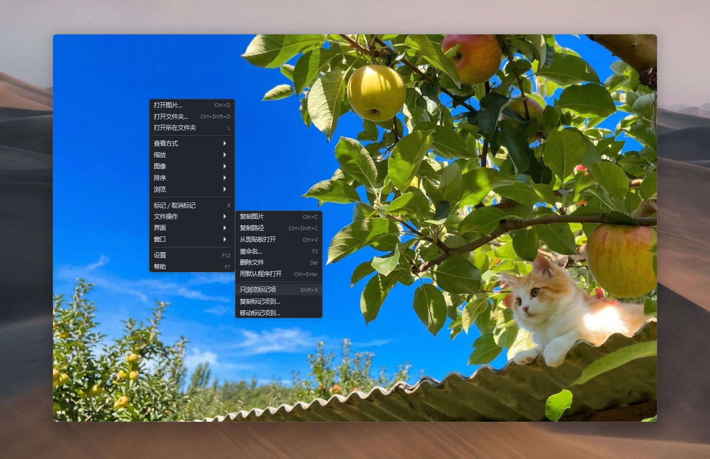
<!-- 截图占位：标记状态和只看标记项 -->

### 图像
| 按键 | 作用 |
|---|---|
| R / Shift+R | 顺时针 / 逆时针转 90° |
| M / Shift+M | 水平 / 垂直翻转 |
| Ctrl+R | 还原所有变换 |

### 动图
| 按键 | 作用 |
|---|---|
| 空格 | 暂停 / 播放 |
| `,` / `.` | 上一帧 / 下一帧 |

GIF、APNG、动画 WebP 都能逐帧看，播放速度也能调。

### 窗口
| 按键 | 作用 |
|---|---|
| F11 | 全屏 |
| Esc | 关闭（如果开着网格、设置这些，先退出它们） |
| Ctrl+M | 最大化 / 还原 |
| Ctrl+Shift+T | 窗口置顶 |
| Ctrl+Shift+W | 窗口缩到跟图片一样大 |

### 界面
| 按键 | 作用 |
|---|---|
| B | 缩略图栏 |
| G | 网格总览 |
| H | 状态浮窗 |
| P | 幻灯片放映 |
| Ctrl+T | 亮 / 暗主题切换 |
| F12 | 设置 |
| F1 | 快捷键帮助 |

记不住也没关系，按 **F1** 随时看，或者在图上点右键，菜单里每一项右边都写着对应的键。

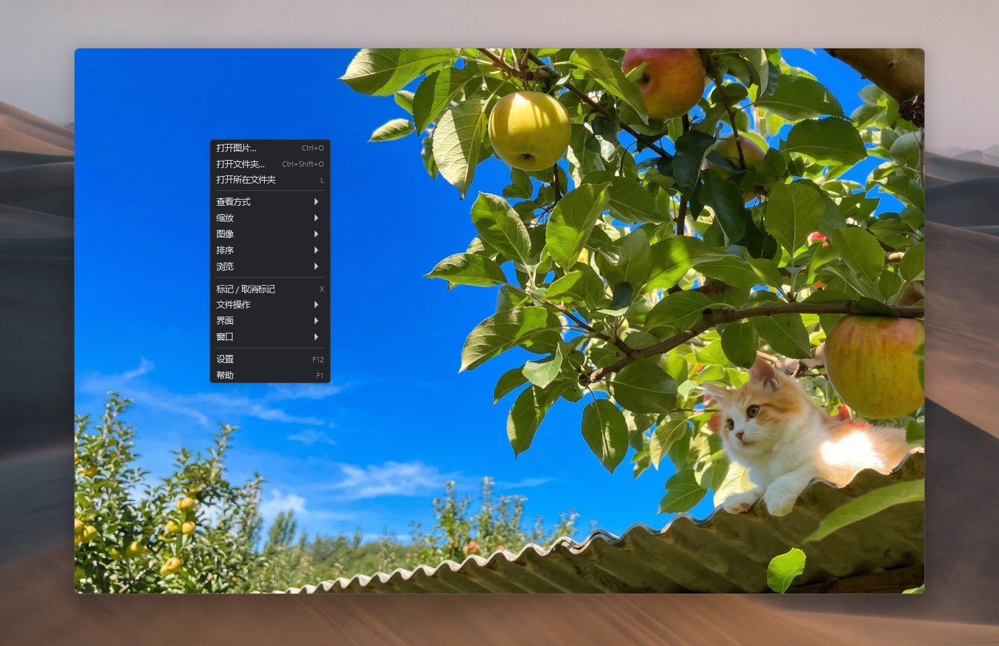
<!-- 截图占位：右键菜单 -->

鼠标的行为也能按查看方式分别设置：比如漫画模式下滚轮是上下滚，
普通模式下滚轮是翻页——这是默认行为，不喜欢可以在设置 → 鼠标里改，
滚轮、Ctrl+滚轮、Shift+滚轮、Alt+滚轮、拖动用哪个键，都能单独配。

## 能打开哪些格式

常见的就不用说了：PNG、JPEG、GIF、WebP、BMP、ICO、APNG、SVG。

Windows 上还能直接看 TIFF、HEIC/HEIF（iPhone 拍的）、AVIF、JPEG XL、DDS，
以及三十多种相机 RAW（佳能 CR2/CR3、尼康 NEF、索尼 ARW、DNG、富士 RAF、
奥林巴斯 ORF、松下 RW2 等等），用的是系统自带的解码能力，不用额外装东西。

PSD 和 RAW 会先秒开里面自带的预览图，不用等完整解码。

如果你电脑里有 ffmpeg，再多支持一批冷门格式：TGA、EXR、HDR、JP2、PCX、QOI、SGI。
程序会自己找 ffmpeg，找不到也可以在设置里手动指路径。

想知道自己这台机器到底能开哪些，去 **设置 → 解码器**，那里列得清清楚楚。

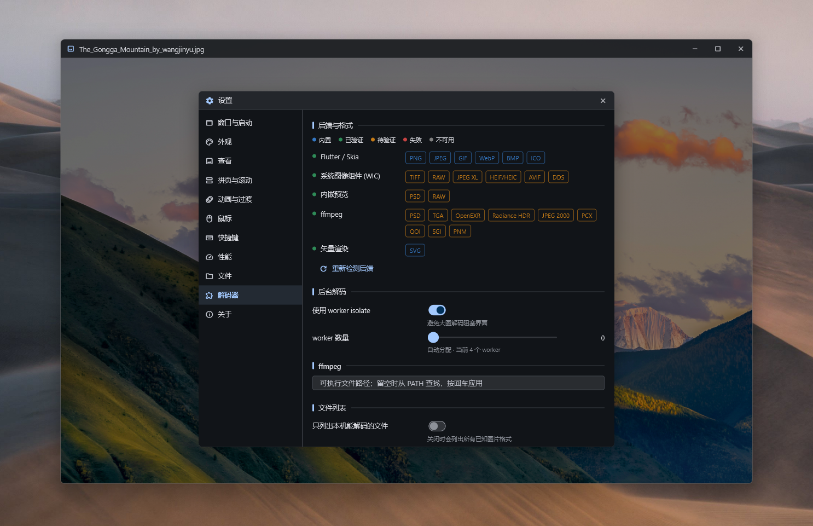
<!-- 截图占位：设置里的解码器状态列表 -->

## 设置里有什么

按 F12 打开，左边一排分类：

- **窗口与启动**——语言、开窗位置和大小、多开时是复用窗口还是每次开新的、要不要恢复上次看的图
- **外观**——亮/暗主题、强调色、背景（纯黑/深灰/浅灰/纯白/棋盘格）、圆角大小、字体大小、标题栏自动隐藏的延时、状态浮窗放哪个角和透明度
- **查看方式**——默认用哪种方式打开、小图要不要放大、双页的间距和方向、漫画模式的预加载
- **动画**——切图的过渡效果（淡入淡出/滑动/缩放，也可以关掉）、动图播放
- **鼠标**——按查看方式分别配滚轮和拖动
- **快捷键**——所有动作重新绑定，支持一个动作绑多个键
- **性能**——缓存占多少内存（默认 768MB）、预取几张、解码质量
- **文件**——排序方式、删除时是否确认、幻灯片间隔
- **解码器**——本机格式支持情况、ffmpeg 路径
- **关于**——版本信息、配置文件在哪

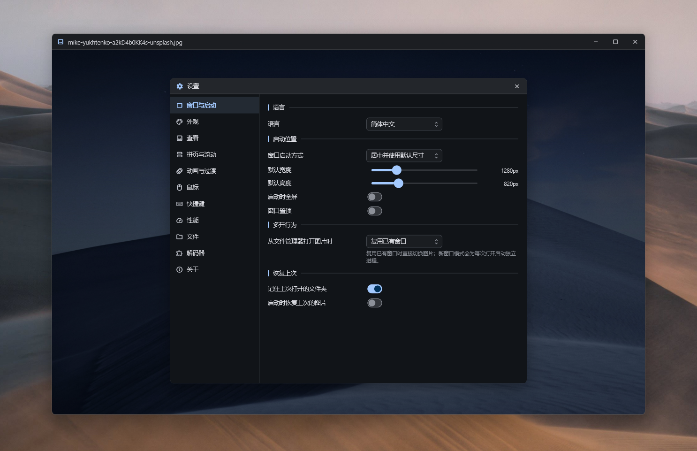
<!-- 截图占位：设置界面 -->

配置存在一个 `settings.json` 里，想换电脑直接拷过去就行。恢复默认设置的按钮也在关于页。

## 一些小细节

- 开着中文输入法的时候快捷键照样能用，不会被输入法吃掉。
- 图片正在解码时不会卡住界面，你还能继续翻页，翻走了的图会自动放弃解码。
- 放大后会在后台重新解码更清晰的版本，所以刚放大那一瞬间有点糊是正常的，稍等就清楚了。
- 文件夹里的图片增删了会自动刷新列表，不用重开。
- 排序用的是"自然排序"，`2.jpg` 排在 `10.jpg` 前面，不会像有些软件那样按字符串排。

## 遇到问题

- **某个格式打不开**：先看设置 → 解码器里它是什么状态。Windows 上很多格式靠系统解码器，
  可以去微软商店装对应的扩展（比如 HEIF、AV1）。
- **图片显示得很慢**：可能是超大图，看看状态浮窗里的解码尺寸。默认最大解到 8192 像素，
  超过的会缩，这是显卡限制。
- **内存占太多**：设置 → 性能里把缓存上限调小。
- **设置乱了想重来**：关于页里有恢复默认。

## 开发相关

代码结构、解码器实现、性能设计这些在 [docs/](docs/) 里：

- [docs/dev.md](docs/dev.md) — 构建、目录结构、性能设计
- [docs/architecture.md](docs/architecture.md) — 整体架构与数据流
- [docs/decoding.md](docs/decoding.md) — 解码子系统
- [docs/release.md](docs/release.md) — GitHub Actions 打包发布与注意事项
- [docs/roadmap.md](docs/roadmap.md) — 待办与已知限制
