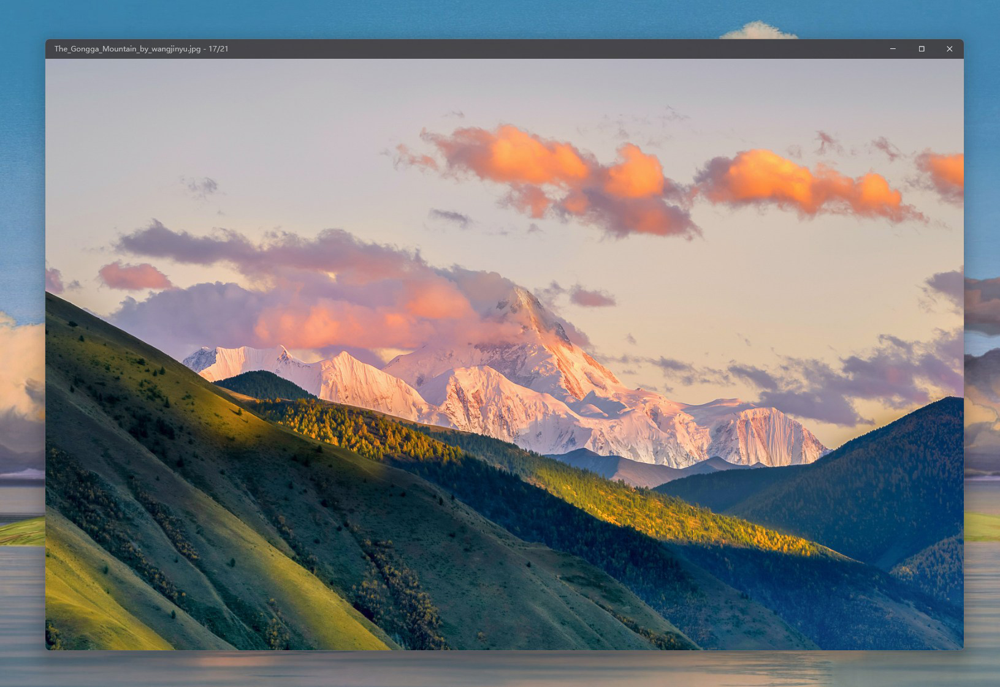
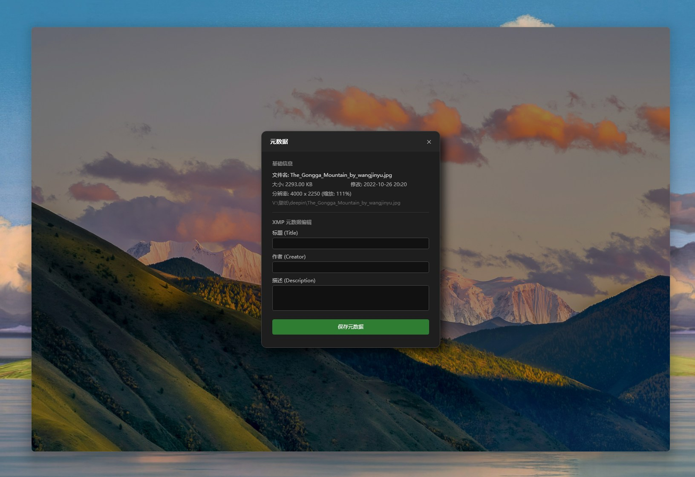
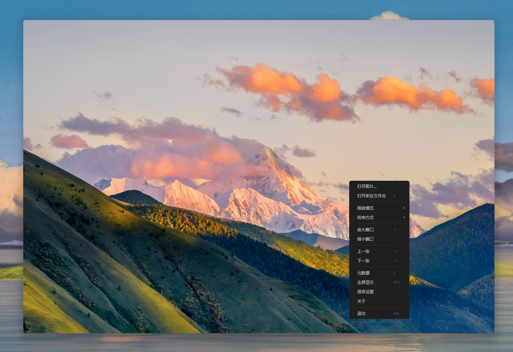
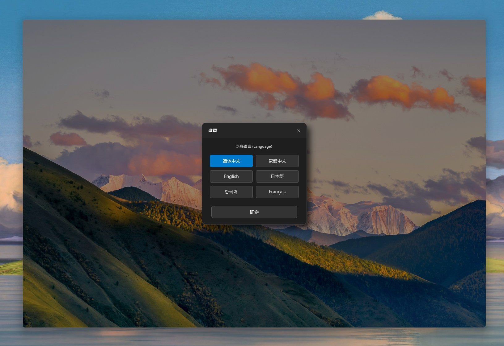
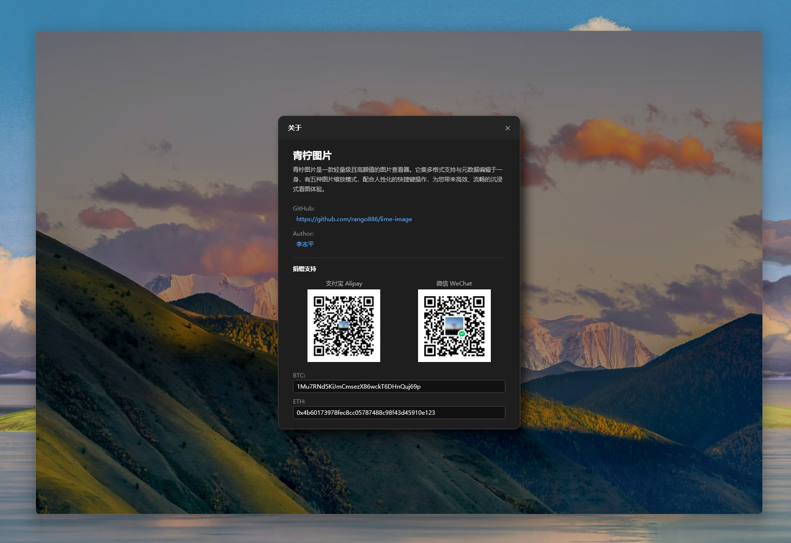

  <a href="README.md">简体中文</a> |
  <a href="README.zh-TW.md">繁體中文</a> |
  <a href="README.en.md">English</a> |
  <a href="README.ja.md">日本語</a> |
  <a href="README.ko.md">한국어</a> |
  <a href="README.fr.md">Français</a>

 

  
  <h1>青檸圖片</h1>

> **青檸圖片** 是一款輕量級、高顏值的圖片檢視器。它集多格式支援與強大的元數據編輯於一身，有五種方便的縮放模式，配合人性化的快速鍵操作，為您帶來高效、流暢且無干擾的沉浸式看圖體驗。

---

## ✨ 核心特性

### 🎨 沉浸式視覺體驗
- **無邊框設計**: 摒棄繁雜的傳統視窗邊框，選單列自動隱藏，滑鼠懸浮時優雅浮現。讓螢幕的每一像素都為圖片服務。
- **流暢的圖片切換**: 深度最佳化的圖片載入邏輯，絲般順滑，拒絕卡頓。

### 🔍 方便的縮放模式
青檸圖片提供 5 種智慧縮放邏輯，滿足不同場景的瀏覽需求（**支援透過數字鍵 `1` - `5` 快速切換**）：
1.  **智慧自動縮放**: 智慧識別圖片長寬比。橫圖優先適應寬度，豎圖優先適應高度，確保圖片始終完整展示在視窗內。
2.  **焦點鎖定縮放 (對比模式)**: 專為連拍挑選或找茬設計。當您在左上角放大觀察細節時，切換至下一張圖片，軟體將自動保持相同的縮放比例和視覺位置，無需重複調整。
3.  **中心鎖定縮放**: 切換圖片後保持目前的縮放比例，始終以畫面中心為基準進行渲染。
4.  **寬度優先**: 強制縮放圖片以填滿視窗寬度（適合閱讀長條漫或網頁截圖）。
5.  **高度優先**: 強制縮放圖片以填滿視窗高度。

### 🛠 強大的功能集
- **多格式元數據編輯**: 不僅支援檢視，還支援編輯圖片的元數據。
- **視窗大小快速調整**: 支援透過快速鍵快速調整軟體視窗尺寸，靈活適應不同解析度的桌面佈局。
- **全格式支援**: 支援 png、jpeg、jpg、bmp、gif、tif、tiff、webp、ico、jfif、heic、heif、avif、jxl、svg、psd、psb、dds、tga、xcf、hdr、exr、dng、cr2、cr3、nef、arw、orf、rw2、raf、sr2、srw、pef、x3f、erf、mef、mos、mrw、3fr、kdc、jp2、j2k、jpf、jpx、jpm、mj2、pbm、pgm、ppm、pnm、pam、pcx
- **靈活的排序方式**: 支援按**檔名**、**修改時間**、**檔案大小**進行正序或倒序排列，檔案管理井井有條。

### 🌍 多語言支援
簡體中文，繁體中文，英文，日文，韓語，法語

---

## ⌨️ 快速鍵指南

為了提升瀏覽效率，青檸圖片提供了豐富的鍵盤快速鍵支援：

| 功能分類 | 按鍵 | 描述 |
| :--- | :---: | :--- |
| **基礎導航** | `←` / `→` / `滑鼠滾輪` | 切換上一張 / 下一張圖片（長按可快速翻頁） |
| | `Home` | 跳轉至資料夾第一張圖片 |
| | `End` | 跳轉至資料夾最後一張圖片 |
| | `Esc` | 關閉視窗 |
| **視圖控制** | `+` / `-` | 快速放大 / 縮小軟體視窗 |
| | `F11` | 開啟 / 退出全螢幕模式 |
| | `L` | 開啟目前圖片所在資料夾並定位檔案 |
| | `I` | 顯示/隱藏圖片 元數據面板 |
| **縮放模式** | `1` - `5` | 快速切換 5 種縮放模式（自動/焦點/中心/寬/高） |
| **排序控制** | `N` / `Shift + N` | 按**名稱** 正序 / 逆序 |
| | `T` / `Shift + T` | 按**時間** 正序 / 逆序 |
| | `S` / `Shift + S` | 按**大小** 正序 / 逆序 |

---

## 🖼 頁面展示

### 1. 沉浸式圖片瀏覽
簡潔的介面，讓視線聚焦於影像本身。

### 2. 智慧懸浮選單
滑鼠靠近頂部時自動呼出，平時隱藏，互不打擾。

### 3. 元數據編輯
快速檢視和修改圖片元數據。

### 4. 高效右鍵選單
常用功能一鍵觸達。

### 5. 國際化支援

---

## 📥 下載與安裝

- **安裝版**: [點選下載](https://github.com/rango886/lime-image/releases/download/1.0/Lime.image.x64.exe)
- **攜帶版**: [點選下載](https://github.com/rango886/lime-image/releases/download/1.0/Lime.Image.portable.zip)

---

## ☕ 捐贈與支援

如果您覺得 **青檸圖片** 提高了您的工作效率或帶來了愉悅的體驗，歡迎請作者喝一杯青檸水，這將支援我持續開發和維護！

